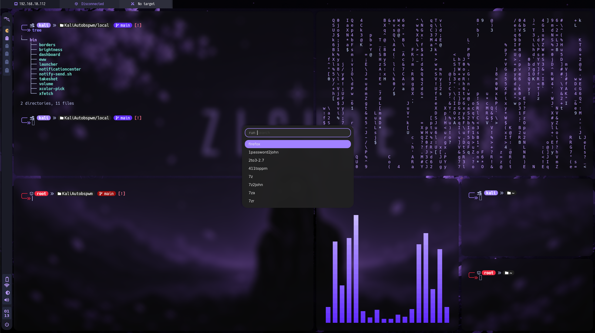
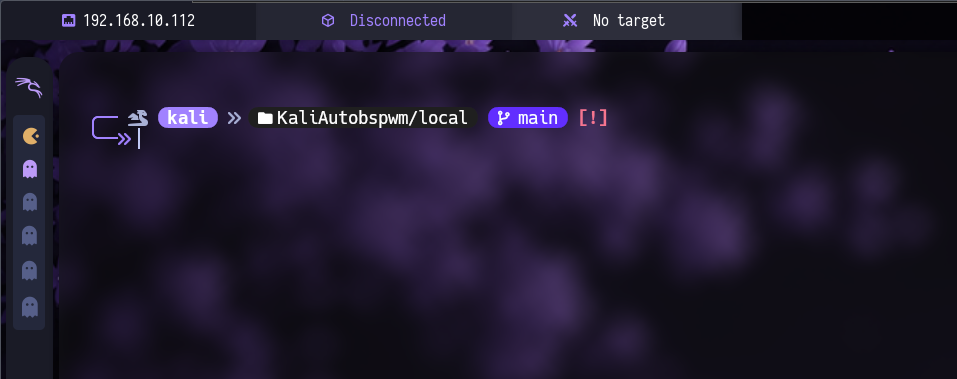
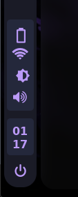
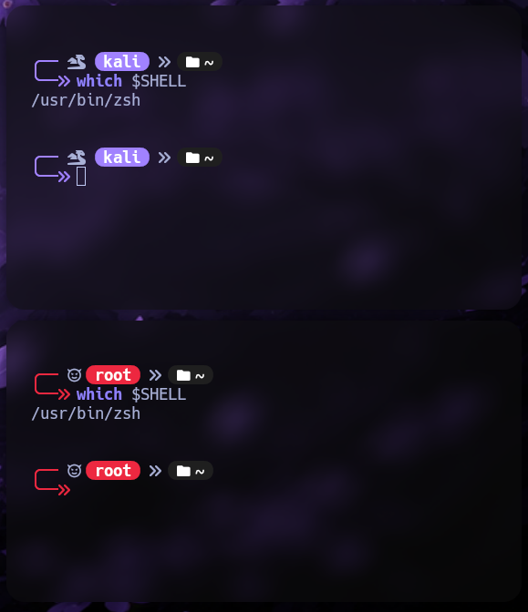
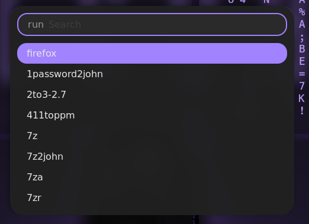
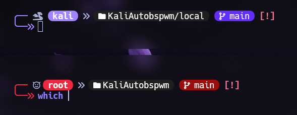
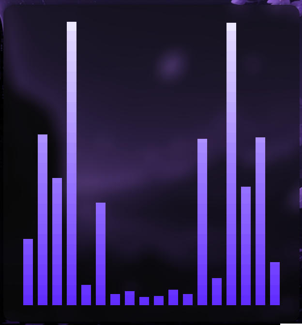

<div align="center">

# 🐉 Kali BSPWM Installation Guide 🐉

</div>

<p align="center">
  <a href="#-english-installation">🇺🇸 English</a> |
  <a href="#-instalación-en-español">🇲🇽 Español</a>
</p>

---

<details>
<summary><h1>🇺🇸 English Installation</h1></summary>

# 🇺🇸 English Installation

Welcome to my Kali Linux customization auto-install repository.  
This project installs and configures my custom BSPWM environment automatically.

## 1. Update your system

```bash
sudo apt update -y
```
```bash
sudo apt upgrade -y
```

## 2. Clone the repository

```bash
git clone https://github.com/ZLCube/KaliAutobspwm.git && cd KaliAutobspwm
```

## 3. Give execution permissions to the installer

```bash
chmod +x Autoinstall.sh
```

## 4. Run the installer

```bash
./Autoinstall.sh
```

## 5. Restart your session

```bash
kill -9 -1
```

</details>

---

<details>
<summary><h1>🇲🇽 Instalación en Español</h1></summary>

# 🇲🇽 Instalación en Español

Bienvenido a mi repositorio de auto instalación para personalización de Kali Linux.  
Este proyecto instala y configura automáticamente mi entorno personalizado de BSPWM.

## 1. Actualiza tu sistema

```bash
sudo apt update -y
```
```
sudo apt upgrade -y
```

## 2. Clona el repositorio

```bash
git clone https://github.com/ZLCube/KaliAutobspwm.git && cd KaliAutobspwm
```

## 3. Asigna permisos de ejecución

```bash
chmod +x Autoinstall.sh
```

## 4. Ejecuta el instalador

```bash
./Autoinstall.sh
```

## 5. Reinicia tu sesión

```bash
kill -9 -1
```

</details>

---

# Showcase

Environment demo



Polybar & EWW bars



EWW widgets



User and Root shells



Rofi app search bar theme



Shell image preview plugin


Starship folder git status



Just a funny plugin for audio track



---

# Features & Dependencies

| Dependency | Description | Repository |
|---|---|---|
| BSPWM | Binary space partitioning window manager | [bspwm](https://github.com/baskerville/bspwm) |
| SXHKD | Simple X hotkey daemon for keyboard shortcuts | [sxhkd](https://github.com/baskerville/sxhkd) |
| Picom | Compositor for transparency, blur and animations | [picom](https://github.com/yshui/picom) |
| EWW | ElKowars Wacky Widgets for desktop widgets | [eww](https://github.com/elkowar/eww) |
| Rofi Network Manager | NetworkManager menu integration for Rofi | [networkmanager-dmenu](https://github.com/firecat53/networkmanager-dmenu) |
| Starship | Cross-shell customizable prompt | [starship](https://github.com/starship/starship) |

---

# Credits

Huge thanks to all the developers and projects that made this customization possible.
    
